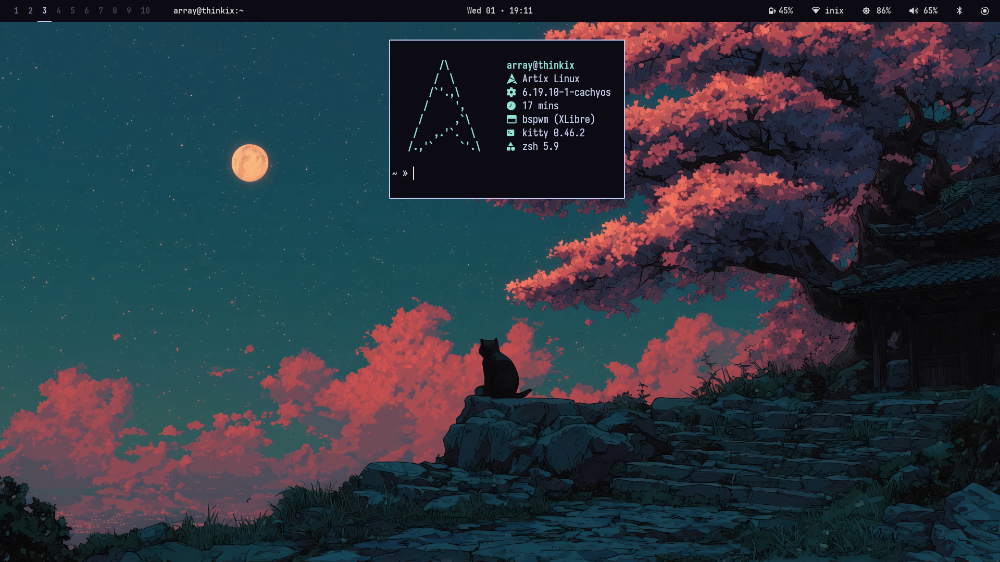

#+TITLE: BSPWM Dots
#+AUTHOR: aellas
#+DESCRIPTION: My personal bspwm dotfiles
#+STARTUP: showeverything

* Software
- Distro: Artix
- Init: OpenRC
- Kernel: CachyOS
- Display Server: Xlibre
- WM: BSPWM
- Bar: Polybar
- Notifications: Dunst
- Editor: Doom Emacs
- File-manager: Yazi / Nemo
- Launcher: Rofi
- Terminal: Kitty

